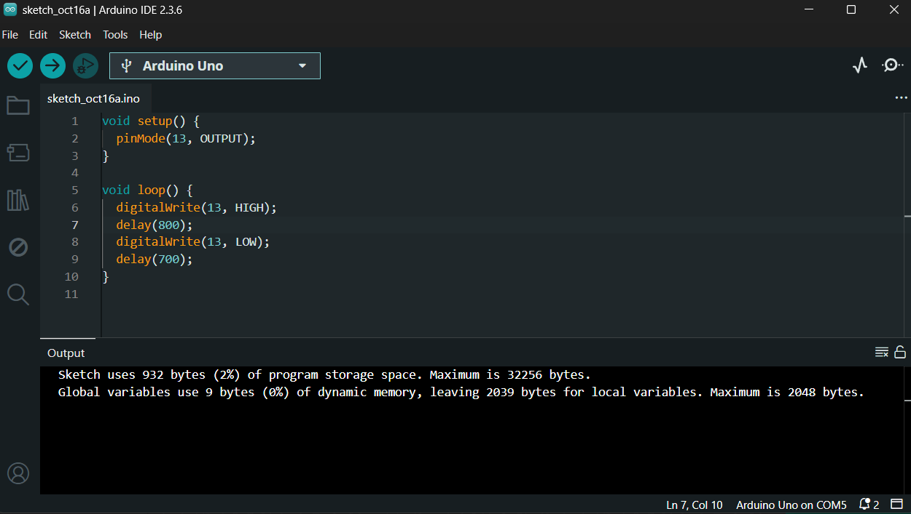
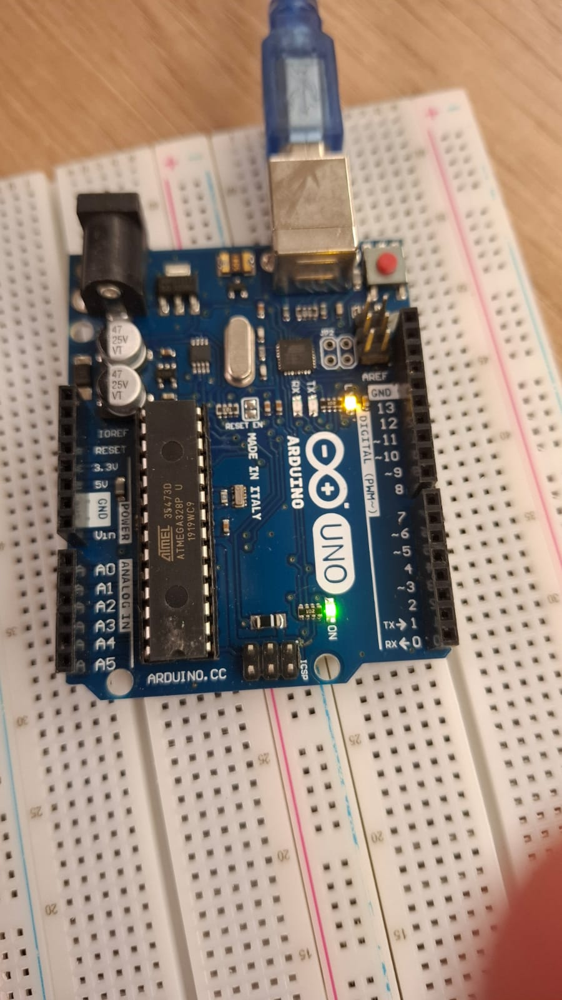

# Semana-1-parte-1

## Blink do LED Interno do Arduino

#### Código de Funcionamento do Arduino:

```C++
void setup() {
  pinMode(13, OUTPUT);
}

void loop() {
  digitalWrite(13, HIGH);
  delay(800);
  digitalWrite(13, LOW);
  delay(700);
}

```






